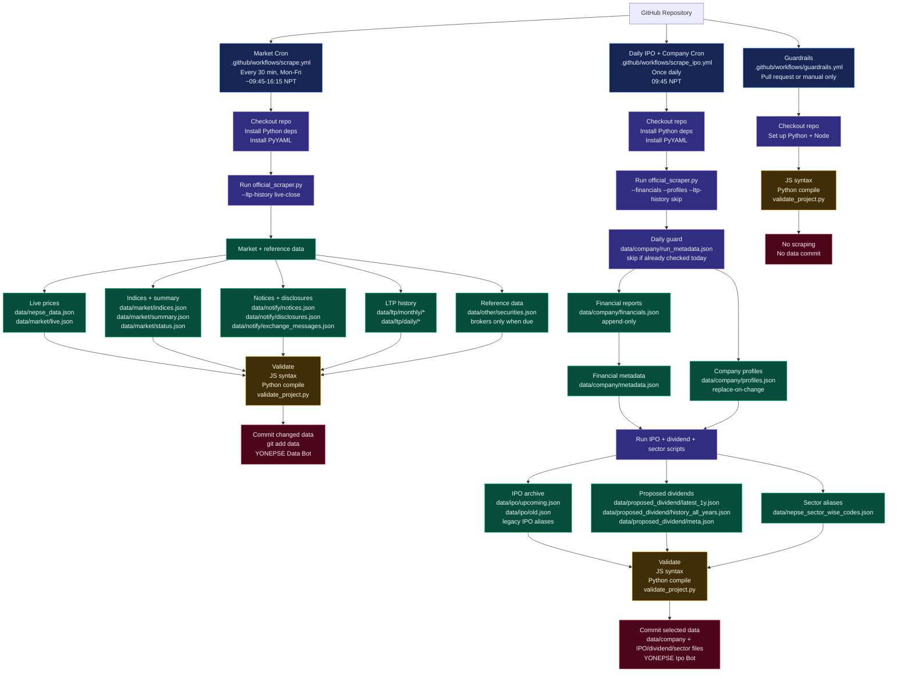

# YONEPSE Data Workflow

This chart shows how the scheduled data jobs move through the repository.

## Estimated Runtime

| Workflow | Schedule | Estimated time | Purpose |
| --- | --- | ---: | --- |
| Market cron | Every 30 min, Mon-Fri market window | Usually a few minutes | Live market, notices, indices, LTP history |
| Daily IPO + company cron | Once daily at 09:45 NPT | About 2-4 minutes | Company financials/profiles, IPOs, dividends, sectors |
| Guardrails | Pull request/manual | Under 1 minute | Validation only |

## Key Rules

| Dataset | Update style | Why |
| --- | --- | --- |
| `data/company/financials.json` | Append-only | Historical financial reports should not be rewritten once captured |
| `data/company/profiles.json` | Replace-on-change | Company descriptions/contact details can be edited by NEPSE |
| `data/company/run_metadata.json` | Daily guard | Prevents financial/profile fetches from running more than once per Nepal day |
| Market files under `data/market`, `data/notify`, `data/ltp` | Frequent refresh/merge | These change during market activity |

